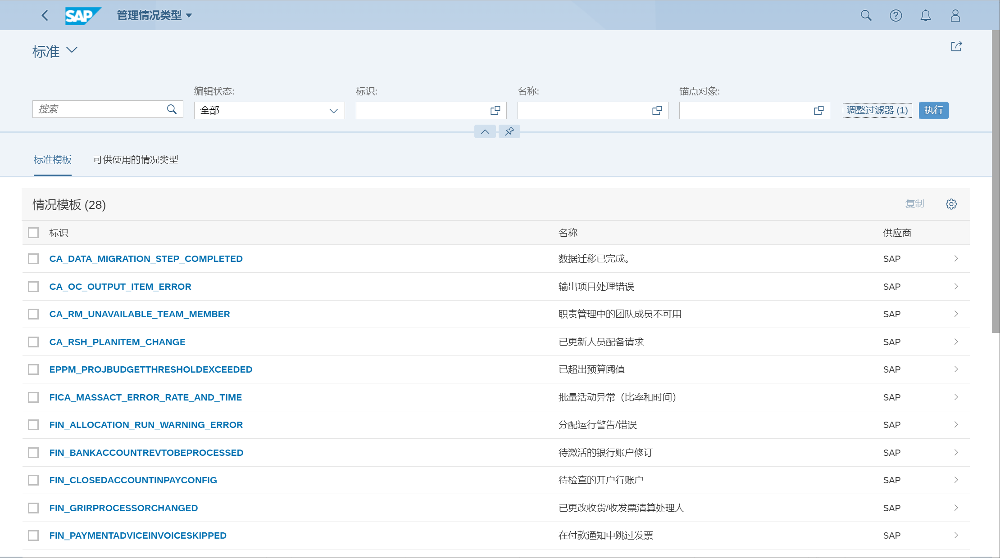

自动识别重要的问题, 通过集成职责管理, 通知用户注意
> 标准框架, 智能情况自动化的监控
>
> 扩展框架, 定制创建的, 处理系统运行的错误、警告消息以及报告

## 角色
> SAP_BR_BPC_EXPERT
>
> SAP_BR_EXTENSIBILITY_SPEC

## App
> Manage Situation Types
>
> Manage Situation Types - Extended
>
> My Situations

