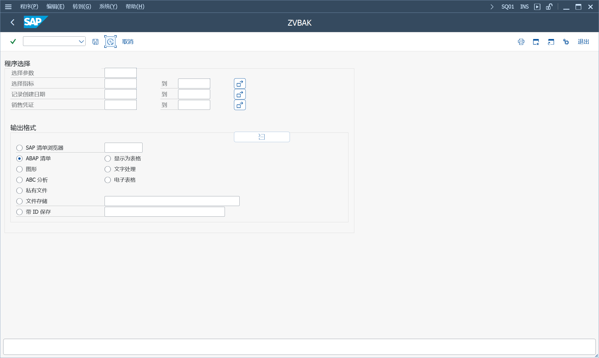

参考 [SAP Help Portal](help.sap.com)
> SAP Query

SAP Query 提供了多种方法来定义报表程序和创建不同类型的报表: 基本列表, 统计信息和排名列表

CNTL_ERROR with SAP GUI 8.00 [3300460](https://me.sap.com/notes/3300460)

## 信息集
信息集构成每个查询的基础, 由一个或多个数据库表组合而成

工具 > ABAP 工作台 > 实用程序 > SAP 查询 >
SQ02 - 信息集
### 创建和更改信息集
数据源: 使用表连接, 直接读取表, 逻辑数据库, 数据由程序恢复, 序列数据集

数据由程序恢复, 指定数据结构后, 通过程序赋值输出

集成程序, 会直接生成程序模板, 需要修改名称, 写取值逻辑

外部程序, 使用之前写好的集成程序

序列数据集, 从服务器读取数据文件, 默认使用二进制模式读取, 且需要和数据结构一致

信息集初始屏幕

菜单, 转到 > 全局属性, 维护 权限组, 权限对象 S_PROGRAM

在菜单, 设置, 图形连接定义

#### 附加
附加表, 附加结构, 附加字段

#### 选择
选择参数, 选择指标

#### 代码
顺序

INITIALIZATION.
> 12 初始设置

AT SELECTION-SCREEN OUTPUT.
> 13 选择屏幕输出

在选择屏幕界面, 输入查询参数, 执行

AT SELECTION-SCREEN.
> 9 在选择屏幕
>
> 选择参数, 检查逻辑
>
> 选择指标, 检查逻辑

selection-screen: begin of block prog
> 1 数据, 声明要在报表中使用的数据, 用于计算的变量

选择字段的声明位置

START-OF-SELECTION
> 2 开始选择, 逐条执行选择
>
> 5 记录处理, 逐条处理

END-OF-SELECTION.

perform %output.
> 6 选择结束 清单前
>
> 8 页码顶部, TOP-OF-PAGE
>
> 7 选择结束 清单后

报表最后位置
> 11 自由代码

#### 增强
自动标识文本

#### HR 逻辑数据库
PNPCE, HR 主数据

PAP, 申请人主数据

PCH, 人员计划, 所有 HR 信息类型

### 显示信息集目录
信息集的查询目录, 可以看到分配的用户组, 查询的名称

在菜单, 环境, 目录, 信息集的查询

在菜单, 转到查询目录

在菜单, 转到列表目录, 查询保存的 ABAP 清单

### 管理信息集
显示, 复制, 重命名, 删除, 保存, 生成, 检查

调整, 字段的技术属性更改时

### 将信息集分配给角色/用户组
使用信息集定义查询之前, 必须先将信息集分配给一个或多个用户组

### BI 属性
需要在 BW 定制

需要在跨客户端的信息集, 环境, 选择 "BI 属性"

然后使用 BEx 查询访问

## 信息集查询
可以在 SQ01 点击 "信息集查询" 跳转, 可以使用信息集查询从信息集中快速读取数据, 而无需先创建查询

### 调用信息集查询
报表类型:

开发, 全局查询区域

临时, 全局查询区域, 标准区域

用于调用信息集查询的报表, 功能模块
> SAP_QUERY_DEVELOPMENT_ROLE, 使用角色访问, 开发
>
> SAP_QUERY_AD_HOC_ROLE, 使用角色访问, 临时
>
> SAP_QUERY_Development, 使用用户组访问, 开发
>
> SAP_QUERY_AD_HOC, 使用用户组访问, 临时

在菜单, 环境, 角色管理, 可以为每个角色分配一个信息集查询
> SQ10 - SAP 查询：角色管理

在信息集查询的报表, 角色 + 信息集, 保存变式

在事务代码 START_REPORT, 通过报表 + 变式, 打开信息集查询

生成默认事务代码, Y_\<SID\>_流水号, 维护事务 START_REPORT 及查询参数

事务代码生成功能逻辑, SRT_CREATE_TCODE_FOR_REPORT

事务代码分配给角色

### 维护信息集查询

列表输出显示, 格式化输出

### 日志
在 SQ02 附加, 设置日志

工作区, 标准 "", 全局 "G"

AQPROTCUST, 查询登录控制, 表

激活日志后, 查询用户何时以及使用哪些选择条件分析了系统数据

AQPROT, 查询登录, 表

BAdI: AQ_QUERY_PROT

## 查询
> SQ01 - SAP 查询: 维护查询

### ABAP 列表的交互函数
列表概览, 查看子列表概览, 切换

选择, 查看选择屏幕上进行了哪些选择

基本列表, 压缩, 展开, 显示总计

显示为表格

SAP 列表查看器

保存和重新显示列表

调用报表, 传输选中的数据, 并执行与此查询关联的报表

报表分配, 接收方报表

### 用于进一步处理列表的交互式功能
将数据传递给其他软件产品以进行进一步处理

隐藏行不会传递, 但是, 隐藏列始终会传递

只能传递第一个子列表, 调用时光标选中, 或第一个

#### 将数据存储为本地文件
下载到文件
#### 电子表格
XXL 清单对象输出到 Excel
#### 图形

#### 文本处理
显示为表格, 字处理, 创建文档

列表内容可以按照规则填充, 自动生成信函, 信封, 分页打印

#### ABC 分析
隐藏列, 显示列, 所有特性, 打印, 新分析

转换, 转换参考货币

#### 导出 EIS 的数据
需要实施 EIS 企业信息系统

通过接口将查询中的数据传输到EIS数据库

#### 私人文件
附加函数池的引入使私人文件夹功能几乎过时

COMD, 增强功能 SQUE0001：数据的私人存储

#### 附加函数池
子列表数据以及此数据的描述, 通过接口传递给另一个程序, 函数模块

通过这种方式附加到查询列表的函数数不受限制

### 创建和更改查询

## 快速查看器
可以在 SQ01 点击 "快速视图" 跳转到, 或直接使用 SQVI 进入
> SQVI - 快速浏览器

数据源可以选择: 信息集, 表, 表连接, 逻辑数据库

特定于用户, 可以转换为查询后, 其他用户使用

SQ01 菜单 查询, 转换快速浏览

SAP 清单 才能显示表头和页脚

## 管理
### 管理用户组
将具有类似任务的用户分组在一起

分配信息集

### 授权
S_QUERY, 维护查询

S_TABU_DIS, 执行查询时直接访问表, 表的授权组

S_DEVELOP, 维护 InfoSet 的存储代码授权, OBJTYPE 值 PROG, OBJNAME 值 AQ* 

### 查询区域
全局区域的查询对象是跨客户端对象

### 语言比较
> SQ07 - SAP 查询: 语言比较

### 传输查询对象
AQGDB, 全局区域, 传输管理

AQLDB, 标准区域, 输出到 AQTDB 传输

输出, 在表 AQTDB 中生成传输数据集

导入, 从表 AQTDB 读取传输数据集

显示, 显示表 AQTDB 中的传输数据集

删除, 从表 AQTDB 中删除传输数据集

### 维护附加功能池
> SQ09 - SAP 查询: 维护附加功能

CMOD, 增强功能SQUE0001：私有数据存储

## 附录
报表命名规则,
ABAP report with the name 'Aqmmb...bq...q' 

SE37, RSAQ_REPORT_NAME

RSAQ_DECODE_REPORT_NAME 报表名称派生属于报表的查询的名称

> aq, 固定前缀
>
> mm, 根据客户端编号确定值, 全局区域, mm = ZZ
>
> b...b, 12位 用户组, 空白补 "="
>
> q...q, 14位 query name, 空白补 "="

### 增强功能 SQUE0001：数据的私人存储
EXIT_RSAQEXCE_001

DATATAB, 数据表

LISTDESC, 数据表字段的描述表

include rxqueu00, 限制 AU 用户组, 审计信息系统 AIS 下载查询数据 [182699](https://me.sap.com/notes/182699)

### 逻辑数据库
SE36 - 逻辑数据库制作器

特殊的 ABAP 程序, 已过时

### SAP 查询: Web 报表的管理
在 SAP_BASIS 7.00 发布版本之前, 还可以通过外部 ITS 发布和执行 SAP 查询

引入内部 ITS 后, 已取消激活事务 SQ11 [2654549](https://me.sap.com/notes/2654549)