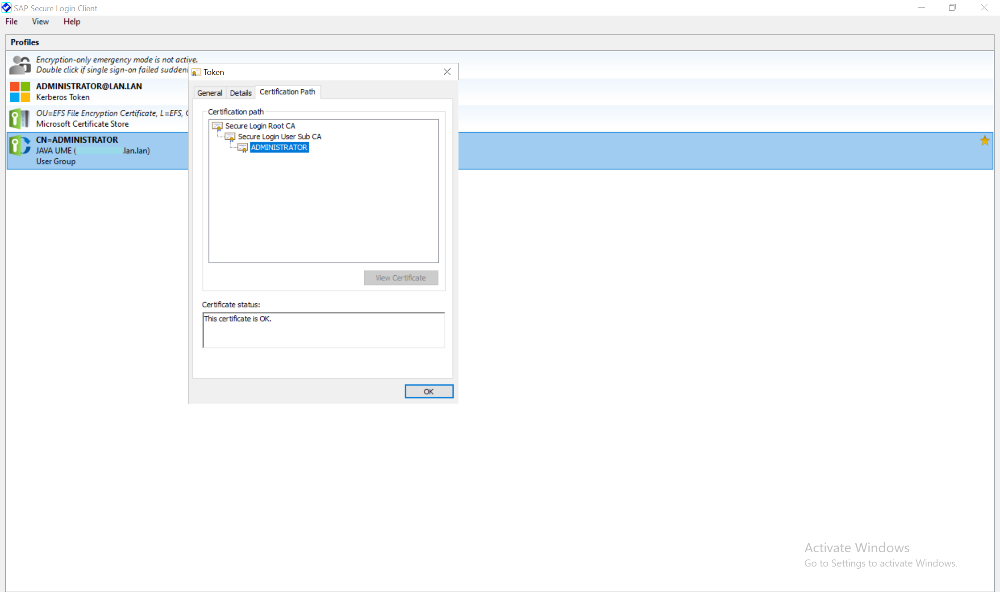

参考 [SAP Single Sign-On](https://community.sap.com/topics/single-sign-on) 
Kerberos、X.509
# 基于 Kerberos
Kerberos/SPNEGO 协议, 由微软域控制器提供

## 域服务 Active Directory Domain Services
需要加入域服务

### 部署域服务
服务器添加域服务

勾选自动重启, 确认安装

安装成功后, 提示需要配置域服务

点击提示处链接, 进入配置域向导, 指定域名称

勾选 DNS 服务器, 否则网络内的计算机, 可能找不到这个域

指定 NetBIOS 名称, 计算机加入域时, 输入这个名称进行网络查找

安装后, 服务器重启

域账户登录

### 新增域账户, 并设置 SPN

账户名可以自定义, 账户用于 Kerberos 凭证通信, 需要设置SPN

用于SAP GUI 登录, SNC 方式
> SAP/\<SID>

用于 Browser 登录, SPNego 方式

> HTTP/\<Hostname>.\<Domain>

### 新计算机加入域

在服务器只能验证 SNC 登录, 无法在 Web Browser 传递 SPNEGO 凭证, 会默认 NTLM Token, 参考 [1732610](https://launchpad.support.sap.com/#/notes/1732610) 3.2.3 NTLM token received

Syslog 如下

> Security: SPNego Authentication received unsupported NTLM Token

因此需要使用新的计算机, 加入域

> 服务器需要新增域账户
>
> 计算机网络适配器, 修改 IPv4 属性, 指定 DNS 服务器地址
>
> 变更计算机名, 输入域的 NetBIOS 名称, 网络上找到域后, 弹出窗口, 输入域账户的用户名、密码

加入域后, 使用域账户登录计算机

## SAP AS ABAP 设置
### 创建 SNC PSE
信任管理器, 查看 SNC 配置, 默认自签名证书
> STRUST - Trust Manager
>
> CN=\<SID>

### SNC 配置 Kerberos / SPNego
使用SNC向导

> SNCWIZARD - SNC Configuration

选择 Kerberos 点击继续, 跳转到 SPNego 配置界面

新增 SPN 用户配置, 用于系统通信

### User SNC 配置
SAP User 和域用户匹配, 用于自动登录

使用 SU01 配置 SCN 数据

也可以批量修改
> SNC1 - Create SNC Name for User 

### 查看 SNC 配置信息

显示 SNC 配置内容
> SNCCONFIG - SNC Configuration

显示 SPNego 配置内容
> SPNEGO - SPNego Configuration

## SAP AS JAVA 设置
### 配置 SPNego
登录 NetWeaver AS Java, 配置 > 安全性 > 验证和单点登录

进入 SPNEGO 配置页签, 添加 Kerberos 配置

输入 SPN 账户的域名

输入 SPN 账户名, 可以新建, 也可以使用原有账户

选择用户映射的模式

启用配置

编辑 ticket 验证组件, 新增 SPNegoLoginModule

### 用户映射场景

AS Java 用户的登录 ID 和 Windows 域名帐户一致时
> 映射模式：仅主体
>
> 源：登录标识

AS Java 用户的邮件地址 和 Windows 域名帐户一致时
> 映射模式：主体@领域
>
> 源：用户属性
>
> 用户属性：email

### User 配置

身份管理 > 配置 > 支持

下载配置文件, 查看 schema.xml 文件, 用户信息对应的"用户属性"值

## 计算机 SNC 设置
### Gui Logon SNC 配置
安装 Gui 时, 选择 SNC 加密库

客户端安全网络设置, 维护 SNC Name

### 安全登录客户端
安全登录客户端, 用于管理安全登录的凭据

### Internet 选项 SPNego 集成
使用 Web Browser 登录时, 需要配置 SPNego 集成登录选项

在安全页签内, 将服务器地址, 加入本地网络

在用户身份验证里, 设置自动登录, 将会使用域账户自动登录服务器, 能够显示出 Web 登录页面

在高级页签内, 安全选项, 勾选启用集成 Windows 验证, 能够将 SPNego 凭证传递到服务端, 实现单点登录

## 计算机 Single Sign-On
### AS ABAP
打开安全登录客户端, 显示的 Kerberos Token 为当前域账户, 

登录 SAP Logon Gui 时, 使用 SNC 方式

登录 Web Gui 时, 使用 SPNego 方式, 本地服务器不能自动登录

### AS JAVA

登录 Web  时, 使用 SPNego 方式, 本地服务器不能自动登录

# 基于 X.509 数字证书
## SAP AS JAVA 设置
### 配置 SINGLE SIGN-ON 3.0
需要安装 SECURE LOGIN SERVER 3.0 组件

分配管理角色： SLAC_SUPERADMIN
> HTTP/\<Hostname\>.\<Domain\>:\<Port\>/SLAC

进行初始化, 同时维护 DNS 名称

下载 Root CA, 安装在计算机的 "受信任的根证书颁发机构"

创建服务器 CA 证书, 用于配置 Java 服务器的 SSL

### 配置 SSL
登录 NetWeaver AS Java, 配置 > 安全性 > 验证和单点登录

使用复制的方式, 从 SECURE LOGIN SERVER 导入服务器 CA 证书, 保存后, 重启 ICM

### 配置 Secure Login Client 策略

选择一个 SPNEGO 配置文件, 复制后, 名称改为 JAVA UME

修改认证策略为 basic

选择一个 SecureLoginDefaultGroup, 复制后, 修改配置文件为 JAVA UME

## 计算机 SNC 设置
### 安全登录客户端
配置策略组

登录后, 显示临时证书, 证书有效期通过配置文件管理

## SAP AS ABAP 设置
### 将外部标识分配给用户
SM30 维护 VUSREXTID 视图, 在 DN 工作区, 新增用户和证书名称的分配关系, 用于 Web Gui 访问
> DN	证书识别名称 (X.500)

## 计算机 Single Sign-On
### AS ABAP
打开安全登录客户端, 登录到 Secure-Login-Server 后, 生成 SSL 证书

登录 SAP Logon Gui 时, 使用 SNC 方式

登录 Web Gui 时, 会弹出证书选择, 选择后, 自动登录

### AS JAVA
没有测试通过