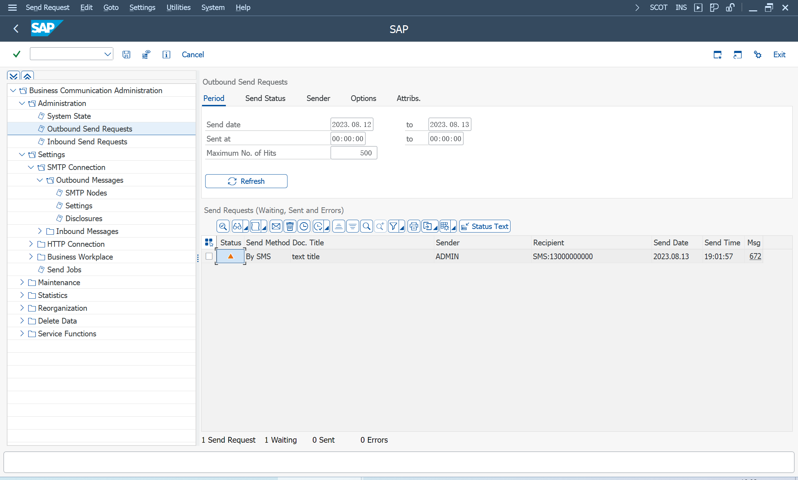

# HTTP 配置
参考 [SAP Help Portal](https://help.sap.com/) 和 [455140](https://launchpad.support.sap.com/#/notes/455140)
> SAPconnect (BC-SRV-COM)

使用 HTTP 协议, 发送短信
> CL_BCS_HTTP_SEND

## 目标地址配置
Tools > Administration > Administration > Network >
SM59 - RFC Destinations

STRUST 配置 SSL

由于发送短信的 API, 采用 RPC 签名风格, 不能直接访问

通过发送到 [发送短信](/Development/Send-Sms/Send-Sms.md) HTTP 服务端, 间接访问

## 出站连接管理
> SCOT - SAPconnect - 管理

### 代码页设置
维护代码页 UTF-8

### 配置 HTTP 节点
使用 POST 方法, 新功能 [1917416](https://me.sap.com/notes/1917416)

使用 GET 方法, Query Url 需要提前编码
> CL_NWBC_UTILITY=>FIELDS_TO_STRING

### 配置发送 Job
短信首先存储在队列中, 需要后台作业执行发送, 保存时可以指定用户

### 查看短信发送
> SOST - SAP连接发送请求

查看短信发送队列, 也可以手动执行发送

## 定义服务名称
使用 SA14 定义服务名称
> SMS Service

配置之后, 可以从 SMS 发送, 否则, 只能通过 SMTP 服务发送 Pager(SMS)

## 发送短信
> SBWP - SAP Business Workplace

类型选择 K Pager number

## 程序发送短信
使用 SE38 参考示例程序, 也是发送到队列
> BCS_TEST19

类/接口
> CL_BCS

## 接收短信
不支持, 只有请求返回的状态通知