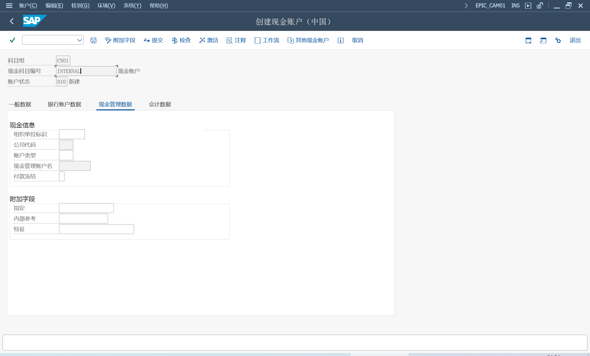

管理和监控公司内外的现金交易的中心位置

中国现金运营 COPC, 集成功能

与现金管理集成，提供现金集中、现金池、现金分配或银行到银行转账功能

与EPIC解决方案集成，以处理支付请求和银行收据

在财务会计中过账到银行总账科目

## 实施
### 维护现金账户主数据
IMG > 财务会计（新）> 银行会计核算 > 业务往来 > 国家特定设置 > 中国 > 现金账户主数据 >
定义现金账户组

会计核算 > 财务会计 > 银行 > 国家特定 > 中国 > 现金操作 >
> EPIC_CAM01 - 创建现金账户

### 中国现金运营信息类型
需要为要处理的组织单位，定义信息类型数据

> 6000	银行账户管理：公司代码
>
> 6001	银行账户管理：COPC 相关
>
> 6002	银行账户管理：利润中心
>
>6003	银行账户管理：成本中心
>
> 6004	银行账户管理：业务范围

### 中国现金运营定制
IMG > 财务会计（新）> 银行会计核算 > 业务往来 > 国家特定设置 > 中国 > 现金账户主数据 >
现金收支申请

跨公司代码付款请求的过账规则

## 使用
### 设置开户行帐户层次结构
EPIC_BAM - 开户行账户层次结构

### 监控现金状况和余额
EPIC_BAM - 开户行账户层次结构
### 现金收据和付款请求
EPIC_RPR - 创建现金收/付请求 

也可以批准从 IDoc 传输过来的数据

EPIC_F8REL - 批准付款请求

### 现金集中
EPIC_GRP - 维护现金池

EPIC_FF73_SET - 现金集中设置

EPIC_FF73 - 处理现金集中

### 导入银行账户余额和交易数据
EPIC_IMP - 从银行账户导入数据

EPIC_IMP_S - 批量获取银行账户数据

### 核对银行和现金交易
EPIC_RECONCILE - 对账银行/现金业务

EPIC_RECONCILE_S - 批量对账银行/现金业务

### 过帐到银行总账科目
EPIC_PRP - 过账到银行总账科目

EPIC_PRP_S - 批量过账到银行总账科目