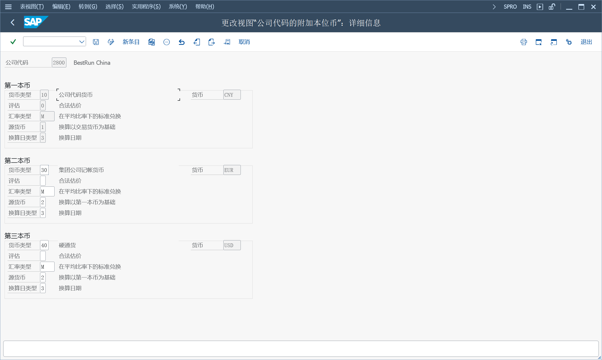

## 货币
IMG > SAP NetWeaver > 常规设置 > 货币

SAP 货币代码 CNY、RMB, 分配的 ISO 货币代码, 都是 CNY

必须选择其中一个 SAP 货币代码作为 ISO 货币代码的主要货币代码, 系统间通信使用的是 ISO 货币代码

如果在国际层面开展业务, 建议使用货币代码 CNY

### 汇率
过账和清算：换算以外币过账或清算的金额

汇率差异：确定汇率差异的收益或损失

外币估价：对外币和外币资产负债表科目评估未结项目, 作为结算操作的一部分
#### 汇率类型
为每个货币对定义不同的汇率, 使用汇率类型区分这些汇率

对于过账和清算, 系统使用汇率类型 M（平均汇率）
#### 参考货币
如果需要在许多不同的货币间进行外币兑换, 可以通过指定汇率类型的参考货币来简化汇率的维护

只能将参考货币用于汇率类型 M（平均汇率）, 而不能用于买入或银行卖出汇率类型。
#### 汇率差价
对于汇率类型, 可以定义平均汇率和买入汇率之间以及平均汇率和银行卖出汇率之间的固定汇率差价

只需输入平均汇率的汇率, 系统通过加减平均汇率的汇率差价来计算买入汇率和银行卖出汇率的汇率
### 平行分类账中的平行货币
在财务会计中, 除了 本地货币, 最多可以为公司代码定义两种平行货币

IMG > 财务会计（新）> 财务会计全局设置 (新) > 分类帐 > 分类账
定义主要分类帐的货币

货币类型"11"、"12"
货币码和本地货币码一样。不能也不必定义其它值, 在编辑公司时维护, IMG > 企业结构 > 定义 > 财务会计 > 编辑, 复制, 删除, 检查公司代码

货币类型"30"、"31"、"32"
在定义集团时维护, SCC4

货币类型"40"
在通货膨胀高的国家中使用硬通货, 在定义国家时维护, IMG > SAP NetWeaver > 常规设置 > 设置国家 > 定义国家

货币类型"50"
在某些高通货膨胀的国家, 为外部报表规定的指数化货币, "索引货币", 也在定义国家时维护

货币类型"60"
公司的内部业务伙伴货币, 在定义公司时维护, IMG > 企业结构 > 定义 > 财务会计 > 定义公司

FI 中并行货币的实施[39919](https://me.sap.com/notes/39919)

成本控制范围：货币类型 20 或 30 [119428](https://me.sap.com/notes/119428)
### 当地货币兑换 （FI-GL）
需要激活新总账会计

IMG > 跨应用组件 > 欧洲货币联盟：欧元

欧元货币定制的确认[636154](https://me.sap.com/notes/636154)
货币定制欧元[135661](https://me.sap.com/notes/135661)