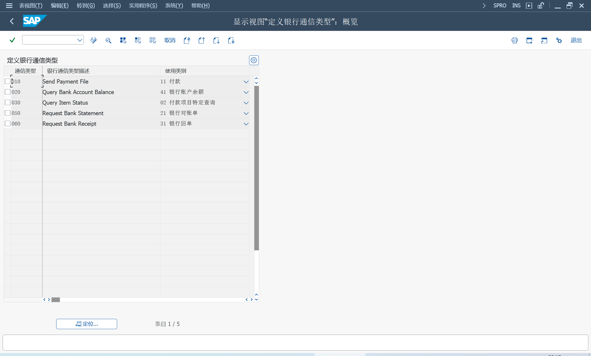
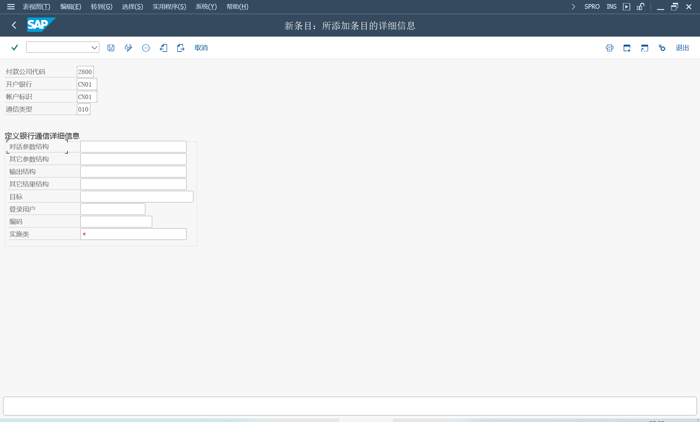
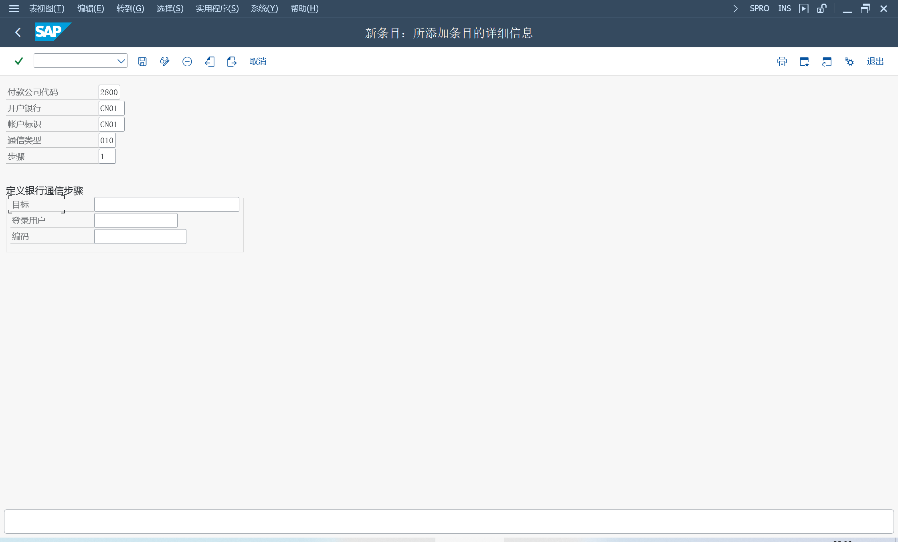
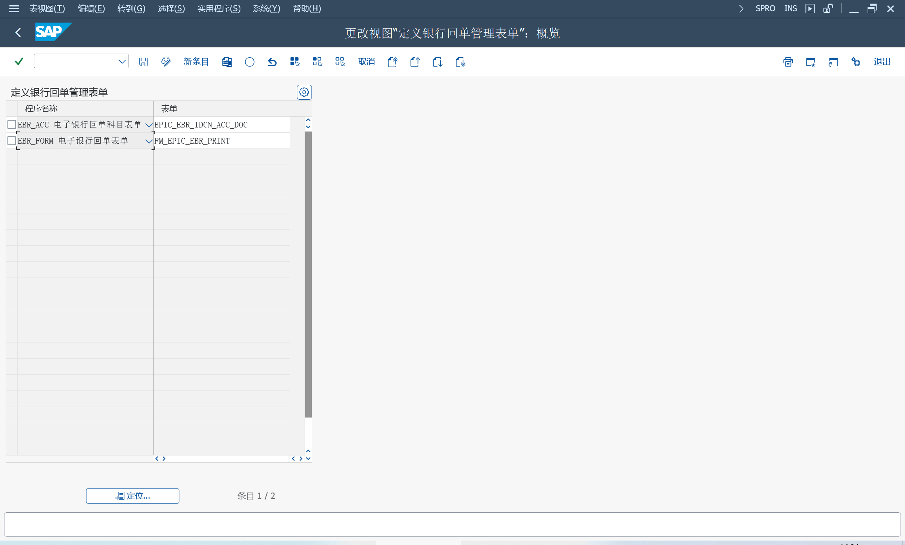

电子支付集成（中国）EPIC 银企直连 RFC 连接前置机方式

与银行直接通信使用的消息没有通用格式, 必须实现特定于每个银行和每个服务的 ABAP 存储库对象和映射

参考付款集成的示例实施[1722840](https://me.sap.com/notes/1722840)
## 激活业务功能
进入 SFW5 依次激活业务功能
### FIN_LOC_CI_16
可直连支付和查询
> F110 - 付款申请
>
> F110 - 创建付款单
>
> DMEE1 - 数据介质引擎 格式树维护工具
>
> OBPM1 - 支付媒介格式的维护
>
> FDTA - 显示和下载支付文件
### FIN_LOC_EPIC_2
新增了 "处理银行对账单" 标签页
> EPIC_LOGON - 维护银行通信登录数据 
>
> FF_5 - 输入电子银行对帐单 
>
> FEB_FILE_HANDLING 银行对账单处理：导入和结转（自动）
### FIN_LOC_EPIC_3
在 "款项处理" 标签页, 新增了 "更改项目" 按钮, 在创建付款单之前, 更改付款信息：帐户、到期日、付款冻结

新增 "银行对帐报表" 将公司银行存款日记帐的期末余额与从银行收到的电子银行对帐单的期末余额进行比较
### FIN_LOC_EPIC_4
在 "款项处理" 标签页, 新增了选择条件：付款方式、开户银行、帐户标识、到期日、付款冻结

可更改多个要付款的项目的付款信息
### FIN_LOC_EPIC_4_2
新增打印银行对帐报表、付款的现金流量类别
### FIN_LOC_EPIC_5
在 "款项处理" 标签页, "付款建议" 按钮, "运行付款请求建议" 和 "显示上次运行的项目" 下拉选项

修复 Warning 状态付款请求项目

在 "款项处理" 标签页, "调整金额" 按钮, "针对发票进行部分付款" 下拉选项

在 "报文处理" 标签页, "重新生成" 按钮, 将包含错误信息的付款文件替换为新付款文件

使用安全令牌实施授权检查

增强扩展付款项目信息, 支持自定义字段

在 "处理银行对帐单" 标签页, "银行存款日记帐"

新增了 "处理银行回单" 标签页, EPIC_BRM

集成 "资金计划", 将付款金额分配给现金预算计划中的流动性项目, 并检查消耗量
### FIN_LOC_EPIC_6
查看付款项目是否已通过 F-53 或 F-28 处理, 并更新状态

在 "款项处理" 标签页, "冲销" 按钮, 冲销已被银行拒绝的付款项目

在 "款项处理" 标签页, "调整金额" 按钮, "调整付款请求金额" 下拉选项 

新增 Web Dynpro 界面角色
> EPIC_CASHIER 收银员
>
> EPIC_CASHIER 会计师
>
> EPIC_BUSINESS_EXPERT 业务专家
>
> EPIC_CASH_MGR 现金经理
>
> EPIC_IT 信息技术专家

增强银行回单处理
###  FIN_LOC_EPIC_7
新的中国现金运营（COPC）解决方案为管理和监控集团公司银行账户的现金交易提供了一个中心位置

# 文件方式
[银行与文件接口集成](/Finance/Treasury/Bank-Integration-with-File-Interface/Bank-Integration-with-File-Interface.md "1EG")
# EDI 方式
需要银行提供 EDI 方式, 或输出 XML 文件

FBZP - 维护收付程序设置

在国家的支付方式, 新增付款方式, 并选择支付媒介程序 RFFOEDI1

在付款公司代码, 维护 EDI附表格式 F110_EDI_01

维护公司代码的支付方式、银行确定

FI12 维护开户行的合作伙伴编号、EDI兼容的支付方式

WE21 设置 XML 文件端口

WE20 设置 B 类型合作伙伴, 出站参数维护 PAYEXT, EUPEXR

RFFOEDI1 设置变式, 选择生成 idoc

F110 打印输出时, 选择变式

WE02 查看 Idoc 发送状态

# 电子支付集成
> EPIC_PROC - 电子支付集成
## 实施电子支付集成
EPIC 中银行连接开发的关键点 [2052800](https://me.sap.com/notes/2052800)
### 付款信息更改
付款方式、开户行、收款人银行
### 支付发布清单和付款程序的定制
财务会计（新）> 应收账款和应付账款 > 业务交易 > 付款 > 自动付款 > 付款发布清单 > 付款发布清单设置

激活应用程序, 输入 EPIC 保存

激活支付发布清单, 勾选激活 FI-PRL, 激活后 F110 生成的付款建议, 由支付发布清单处理
### 定义银行通信类型
财务会计（新）> 应收账款和应付账款 > 业务交易 > 国家特定设置 > 中国 > 电子支付中心

### 定义银行通信详细信息

### 定义银行通信步骤

### 银行对账单
财务会计（新）> 应收账款和应付账款 > 业务交易 > 国家特定设置 > 中国 > 电子支付中心 > 银行对账单
#### 银行对账单的自定义
##### XSLT 转换
FEBKO
FEBEP
FEBRE
FEBCL

##### XML 格式和银行特定格式
财务会计（新）> 银行会计核算 > 业务往来 > 支付交易 > 电子银行对帐单 > XML 格式和银行特定格式
###### 定义映射过程

分配格式 

VFIEB_MAPP_XCUST

###### 定义映射格式

##### 进行电子银行对帐单的全局设置
数据导入设置

定义逻辑路径

定义导入参数

定义过账参数

### 银行回单
财务会计（新）> 应收账款和应付账款 > 业务交易 > 国家特定设置 > 中国 > 电子支付中心 > 银行回单

SE18, EPIC_EBR_PRPS_IMP

FEBKO, 电子银行对账单头记录
FEBEP, 电子银行对账单行项目

FEBKO - ANWND = '0005' 电子银行收据

#### 定义银行回单表单
打印 XDP 格式

#### 银行回单的附加定制
SE18, ES_EPIC_BRS_PROPOSE_DEFAULT
##### 进行电子银行对帐单的全局设置
##### 银行收据和电子银行对账单处理之间的集成
FEB_BSPROC_FE, 银行对账单后处理

对银行回单 FEBEP 做更改, 记录到如下

FEBKO, 电子银行对账单头记录
FEBVW, 电子银行管理记录
EPIC_EBR_FEB, 银行收据的银行对账单行项目的附加数据

可以添加或分配，到 AVIK/AVIP

EPIC_EBR_AV, 银行收据的付款通知行项目的附加数据

### 现金预算定制
#### 定义现金预算计划的组织单位
定义现金预算计划的组织单位

> EPIC_CB_ORG

#### 修改现金预算模板
预算计划
> EPIC_CB_PLAN

### 审批流程定制
SE18, EPIC_APPROVAL_CONTROL

CL_EPIC_APPR_CTRL_EXAMPLE_01, 四眼原则, 任意2个人审批

CL_EPIC_APPR_CTRL_EXAMPLE_02, 三层方法, 按层级审批，高层任意一人审批
### 支付项目信息扩展的定制
扩展付款项目信息

SE18, EPIC_EXTENSIBILITY_CONTROL

运行自动付款后, 数据从 BSEG 复制 FPRL_ITEM, 可以增强自定义字段

EPIC_EXT_SMPL_PROCESS_00001120, 将自定义字段值, 复制到清账/付款文件上

### 安全令牌验证的设置
SE18, EPIC_VALIDATION_CONTROL
### 授权检查

## 使用电子支付集成

运行付款方案, 创建要付款的项目

提交到付款审批流程

批准项目

付款, 即创建付款单

将付款指令作为电子付款文件发送到开户银行

监控发送到银行的项目的状态

### 检查银行通信的状态
EPIC_MONI
### 具有电子支付集成的银行收据管理
获取电子银行收据, 过账

FEB_BSPROC_FE