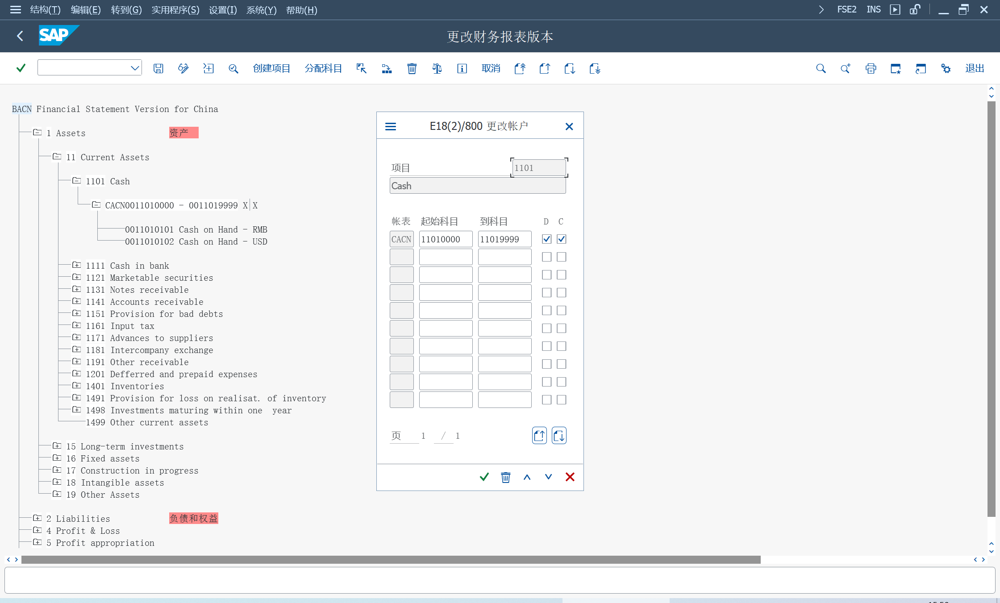

## 激活业务功能
SFW5 激活业务功能
### FIN_LOC_CI_11
财务报表, 资产负债表和损益表

现金流量表

总账科目凭证

总账科目余额

损益结转
### FIN_LOC_CI_13
财务报表, 每个利润中心, 每个业务领域, 不同货币表示

总账科目余额, 以科目级别层次结构显示

### FIN_LOC_CI_24
财务会计和运营

Web Dynpro 应用程序

## 定制
### 损益结转定制
IMG > 财务会计（新）> 总账会计（新）> 定期处理 > 报表 > 法定报表: 中国 > 财务报表 > 公司代码的损益结转 >
针对公司代码激活损益结转

IMG > 财务会计（新）> 财务会计全局设置 (新) > 销项税/进项税 > 过账 > 
为非征税事务分配税务代码

IMG > 财务会计（新）> 总账会计（新）> 主数据 > 总账科目 > 准备 >
定义留存收益科目

### 财务报表定制
IMG > 财务会计（新）> 总账会计（新）> 主数据 > 总账科目 >
定义会计报表版本

IMG > 财务会计（新）> 总账会计（新）> 定期处理 > 报表 > 法定报表: 中国 > 财务报表 >
将 PDF 表格分配到程序, RFIDCN_BSAIS

为财务报表定义表格结构

为财务报表导入和导出表格结构, XML 格式

### 现金流量表的定制
IMG > 财务会计（新）> 总账会计（新）> 定期处理 > 报表 > 法定报表: 中国 > 财务报表 >
将 PDF 表格分配到程序, J_3RFFORM4

定义现金流报表版本

为调整凭证定义编号范围
> ADJNR

抵销帐户的增强确定, 在会计凭证包含多个借方或贷方项目时, 拆分费用和收入明细项

SE18, IDCN_CASHFLOW_ES

### 总账科目余额和科目凭证的定制
IMG > 财务会计（新）> 总账会计（新）> 定期处理 > 报表 > 法定报表: 中国 > 财务报表 >
将凭证类型分配到总帐科目凭单类型

将 PDF 表格分配到程序, RFIDCN_ACCTBLN, RFIDCN_ACC_DOC

SE18, IDCN_ACC_BAL, IDCN_ACC_DOC

## 定期处理
### 损益结转
将每月损益表余额（P&L）结转到留存收益账户

会计核算 > 财务会计 > 总账 > 期间处理 > 关账 > 未清/关账分录 > 中国 >
> IDCNPLFWD - 损益结转

## 法定报告
### 财务报表
会计核算 > 财务会计 > 总账 > 信息系统 > 总账报表（新）> 财务报表/ 现金流 > 中国 >
> IDCNBSAIS - 财务报表

### 现金流量表
一份关于其现金和现金等价物在给定时期内变化

会计核算 > 财务会计 > 总账 > 信息系统 > 总账报表（新）> 财务报表/ 现金流 > 中国 >
> IDCNCASH - 现金流量表, J_3RFFORM4

> J3RKKRD - 手动抵销科目确定

### 维护帐户级别层次结构
会计核算 > 财务会计 > 总账 > 信息系统 > 总账报表（新）> 账户余额 > 中国 >
> IDCNALG - 科目级别层次结构

### 总账科目余额
会计核算 > 财务会计 > 总账 > 信息系统 > 总账报表（新）> 账户余额 > 中国 >
> IDCNACCTBLN - 总账科目余额, RFIDCN_ACCTBLN

### 总帐科目凭证
会计核算 > 财务会计 > 总账 > 信息系统 > 总账报表（新）> 凭证 > 中国 >
> IDCNDOC - 总帐科目凭单, RFIDCN_ACC_DOC

## 报表
参考角色, FUCN_GL_ACCOUNTANT
> WDR_CHIP_PAGE

## 凭证审核
IMG > 财务会计（新）> 财务会计全局设置 (新) > 国家特定设置 > 中国 > 用户界面和流程 > 凭证审核 >
定义凭证审核设置