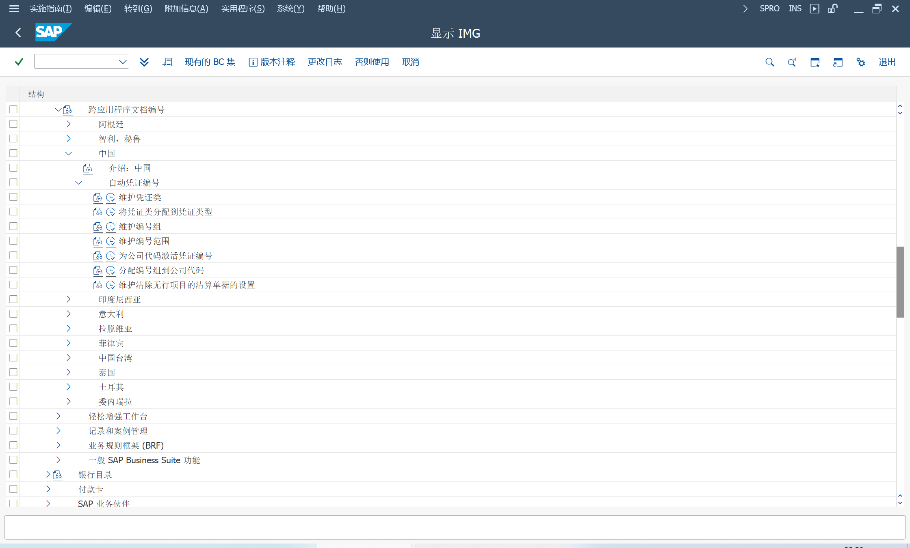

系统可以在过账时为会计凭证生成正式凭证编号
## 激活业务功能
FIN_LOC_CI_11

## 官方凭证编号（中国）
IMG > 跨应用组件 > 一般应用功能 > 跨应用程序文档编号

### 维护凭证类
维护凭证类, 最长支持2位长度, 通过凭证类分配不同的编号组, 确定不同的编号范围

### 将凭证类分配到凭证类型
选择生成 ODN 编号

### 维护编号组

### 维护编号范围
按照会计期间、会计年度维护, 序列号不能重复, 且只有最后6位有效, 前面6位可以使用会计年度+期间, 组合区分。

### 为公司代码激活凭证编号

启用通过会计凭证打印生成[2114439](https://me.sap.com/notes/2114439)

### 分配编号组到公司代码
为公司代码 + 凭证类, 分配编号组、前缀

对于所有文件, 正式文件编号由以下五个部分组成, 写入字段 BKPF-XBLNR_ALT, 长度 26

> 前缀, 最长10位
>
> "_", 分隔符1位
>
> 凭证类, 最长2位
>
> 会计年度, 固定4位
>
> 会计期间, 固定2位
>
> "_", 分隔符1位
>
> 序列号, 固定取后6位

## 会计凭证
可选择创建会计凭证或日记帐分录时, 生成官方凭证编号
## 会计凭证打印
也可以选择后生成, 在打印执行时, 生成官方凭证编号

会计核算 > 财务会计 > 总账 > 信息系统 > 总账报表（新）> 凭证 > 中国 
> IDCNDOC - 总帐科目凭单

备选参考字段, Q_RV201511_000005, 分隔符为程序固定值

