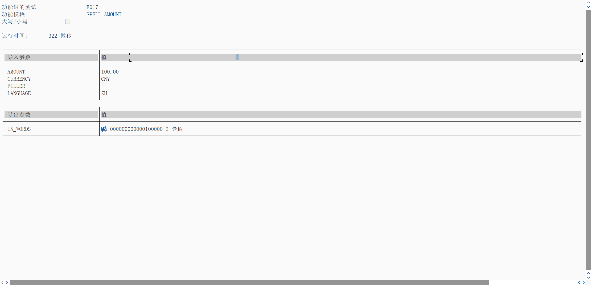

数字转换为预期单词
参考 [939145](https://me.sap.com/notes/939145)

使用匹配表 T015Z [2677439](https://me.sap.com/notes/2677439)

> SPELL_AMOUNT
>
> SPELL_AMOUNT_CN, 考虑小数位, 角分依然需要拆, 效果不大
>
> RF_SPELL, 效果演示

如果需要将点后的每个数字单独转换为单词, 则需要使用输入参数 DECIMAL 再次调用 SPELL_AMOUNT

如果还需要显示货币, 比如元角分, 需要应用程序调用时, 自己写逻辑处理

货币作为输入参数的唯一目的是确定小数位

