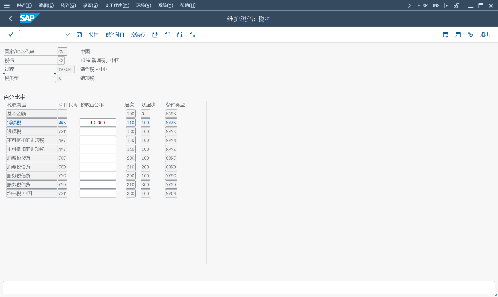

# 税收
税收计算
税务过账
调整
税务申报
## 销售和采购税
根据增值税原则, 对每笔交易征收销售和采购税

税收类型分为国家、区域级, 可以根据地区或税务管辖区的税率计算, 美国的税务管辖区很多, 建议使用税务接口系统计算
### 税码
IMG > 财务会计（新）> 销项税/进项税

在基本设置, 查看税计算过程 TAXCN, 这里分配了条件类型、税科目, 在维护税码的时候使用

在计算, 定义销售/采购税代码, 维护税码税率、税类型、检查指标

在过账, 定义税务科目, 分配过账码和税科目
### 总账科目中的规格
税收类型、允许含/不含税过账、仅自动过账, 为计算、检查和过帐销售/采购税制定规范

税科目, 维护 "税收类型", 只支持销项税科目 ">" 和进项税科目 "<", 有余额时不允许更改税类型。为销项税科目设置 "仅自动过账" 标识

统驭科目, 维护 "税收类型", 允许所有 "*"、仅允许销项税 "+"、仅允许进项税 "-"。过账时, 税码将默认 "**"

其他总账科目, 银行账户不能维护 "税收类型"
### 预付款
预付款过帐到特殊统驭科目

一般不过帐任何销售/采购税, 不维护 "税收类型" 内容

若需要过账到税科目, 维护 "税收类型", 净值 "+"、"-", 毛值 "+B"、"-B"

### 递延税
#### 定制
在计算过程, 增加条件类型, 用于递延税计算

在税码, 增加递延税码, 特性内分配目标税码, 用于将递延税从递延税代码转移到目标税码

IMG > 财务会计（新）> 总账会计（新）> 定期处理 > 报表 > 销售/采购税返还 > 递延税款
定义延期的税收规则

#### 运行
会计核算 > 财务会计 > 总账 > 报表 > 税务报表 > 常规 > 递延税

运行报表, 递延税传输
### 部分免税组织
### 向税务机关报告
财务结算和报告的外部报告

> S_ALR_87012374 - 进/销项税预先申报, RFUMSV00
>
> FB41 - 应付税款记帐 

### 增值税退税
IMG > 财务会计（新）> 总账会计（新）> 定期处理 > 报表 > 含权限的电子通讯

> FBTR - 增值税退税
>
> FOTV - 管理报表数据传输

#### 退税定制

定义退税条件类型

全球贸易管理中的定价程序配置

将退税类别分配给条件类型

退税过账定制

导入退税率数据
已集成 GTS 系统将退税率传输到数据库中, 
也可以手动上传
> RP_GTCN_TAX_REFUND_RATE_UPLOAD

定义退税文件格式

SM30, 
> GTCN_V_ACC_DET, 定义退税过帐规则
#### 上传退税文件
上传从税务局返回的退税数据
Web Dynpro 应用程序
> GTCN_TAX_REFUND_FILE_SEARCH

### 销售/采购税电子预报表
创建销售/采购税的预报表：选择报告数据
RFUMSV00

编辑和发送报告数据：向当局传输电子数据
FOT_B2A_ADMIN

### 数据介质交换引擎
> DMEE1 - 数据介质引擎 格式树维护工具
>
> STRANS - 启动转换工具
>
> OBPM1 - 支付媒介格式的维护
#### 传出文件
以平面文件或 XML 格式发送（例如, 发送给银行或税务机构）的数据介质交换 （DME） 文件

IMG > 跨应用组件 > 一般应用功能 > DME 引擎
BAdI

树类型
> PAYM, 付款程序, 创建要发送到银行的文件, [银行与文件接口集成](/Finance/Treasury/Bank-Integration-with-File-Interface/Bank-Integration-with-File-Interface.md "1EG")
>
> UMS1、UMS2、UMS3, 销售和采购税预报表, RFUMSV00、RFUVXX00
>
> WTRE, 通用预扣税报告, RFIDYYWT
>
> ASLD, 欧共体销售清单, RFASLD20
>
> DEBT, 1099-C 债务取消, RFIDUS99C
#### 传入文件
来自银行的电子银行对账单

> MCSH	收入文件转换为MultiCash, DMEECONVERT1
#### 创建格式树
数据映射

退出模块
> 传出：DMEE_EXIT_TEMPLATE或DMEE_EXIT_TEMPLATE_EXTENDED
>
> 传入：DMEE_EXIT_TEMPLATE_IN_MAPPING

如果已选择退出模块选项作为映射程序, 则不要使用任何标准转换功能[2262060 ](https://me.sap.com/notes/2262060)
#### 激活格式树
#### 测试活动格式树
#### 传输格式树
#### 跟踪格式树处理
#### 版本管理
### 国外工厂
需要向外国税务机关报税、其他欧盟国家的欧共体销售清单
IMG > 财务会计（新）> 财务会计全局设置 (新) > 销项税/进项税 > 基本设置 > 海外工厂

管辖区代码、税务程序和税码

### 跨公司代码交易的税务分摊
在跨公司代码交易记录的情况下, 总税额仅过帐到第一个公司代码并显示在第一个公司代码中, 不包括其他公司代码中产生的税款

但是, 在某些国家/地区, 例如日本或丹麦, 必须为每个公司代码单独显示产生的税额

IMG > 财务会计（新）> 财务会计全局设置 (新) > 销项税/进项税 > 过账 > 跨公司代码交易税转移转帐

RFBUST10, 跨公司代码转账过账