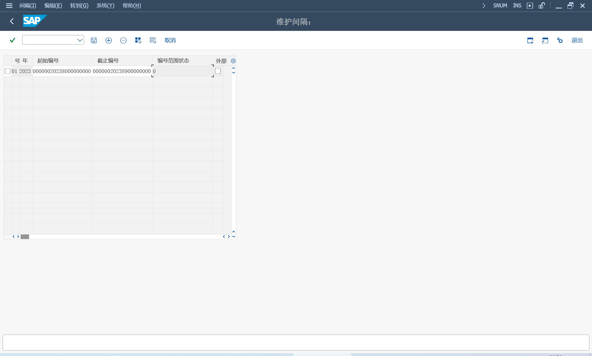
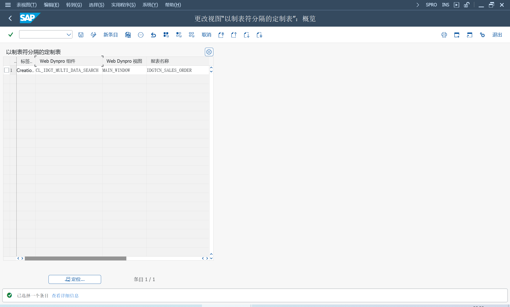

使用金税系统 GTS 开具增值税发票

发票编号和打印、取消正式发票编号以及增值税发票的法定报告都在 GTS 内完成

## 激活业务功能
SFW5 激活业务功能
> FIN_LOC_CI_1
>
> FIN_LOC_CI_9
>
> FIN_LOC_CI_26

创建出站文件, 格式 SJJK0101、SJJK0102、SJJK0201

上传入站文件, 可选择不同文件模板

金税发票清单, 生成金税系统已为其开具正式发票编号的发票清单

定义客户类型, 设置客户类型, 一般纳税人或普通纳税人, 事务 GT_CUS

## 定制
金税接口配置向导[1868902](https://me.sap.com/notes/1868902)

IMG > 销售和分销 > 开票 > 开票凭证 > 国家相关特征 > 中国的国家特定特征

### 定义 GTI 金税发票配置编码

GTI XML 格式版本[2408915](https://me.sap.com/notes/2408915)

### 定义发票类型
> GT_CUS 

### 向税码分配商品税目

商品税目参考 "商品和服务税收分类编码表" 2、3层

维护物料税收分类编码：IDGT_MATL_CODE

### 维护编号范围

### 多数据源
激活多数据源, SE38
> IDGT_SET_DB_CONFIG

### 确定附加源凭证
SM30
> IDGT_TAB_CONF_V

## NWBC 服务
SICF, 激活服务 APP_IDGT

### 角色配置
直接点击服务, 会报错无配置, 需要配置角色
> SAP_SD_GTI_TAX_ACCOUNTANT

> SAP_SD_GTI_OPERATION

### 出站文件
类 CL_IDGT_UTILITY 的方法 CONVERSION_ITAB_2_EXCEL2007 中的语法错误[2636175](https://me.sap.com/notes/2636175)

## 版本
财务本地化中的过时事务代码和程序[2227963](https://me.sap.com/notes/2227963)

不同版本的 SAP GTI 数据库表信息[2486234](https://me.sap.com/notes/2486234)
### GTI GUI 版本
事务代码
> GT_ULN - 创建金税系统导出文件
>
> GT_DLN - 从金税系统接口导入文件
>
> GT_IVL - 发票清单

表
> IDGT_INFO, GTI China: Data sent to GT

### GTI NWBC 版本 未激活新数据库
参考角色 SAP_SD_GTI_TAX_ACCOUNTANT

表
> IDGT_INFO, GTI China: Data sent to GT
>
> IDGT_MERGE_INFO, Item Merge Info

### GTI NWBC 版本 已激活新数据库
参考角色 SAP_SD_GTI_OPERATION

表
> IDGT_GTDM, Mapping of SAP Document and GT Document
>
> IDGT_GTDH, GT Document Header
>
> IDGT_GTDI, GT Document Item
>
> IDGT_VATM, Mapping of GT Document and VAT Invoice
>
> IDGT_VATH, VAT Invoice Header
>
> IDGT_VATI, VAT Invoice Item

### GTI NWBC 版本 S4HANA
参考角色 SAP_SD_GTI_OPERATION

表
> EIV_GTD_MAP, Mapping of SAP Document and GT Document
>
> EIV_GTD_HDR, GT Document Header
>
> EIV_GTD_ITM, GT Document Items
>
> EIV_TAX_MAP, GT Document and Tax Invoice Mapping
>
> TXI_HDR, China Tax Invoice Header
>
> TXI_ITM, China Tax Invoice Item

## 功能增强

多种税率和完全数字化的电子发票[3328113](https://me.sap.com/notes/3328113)
需要升级 SP